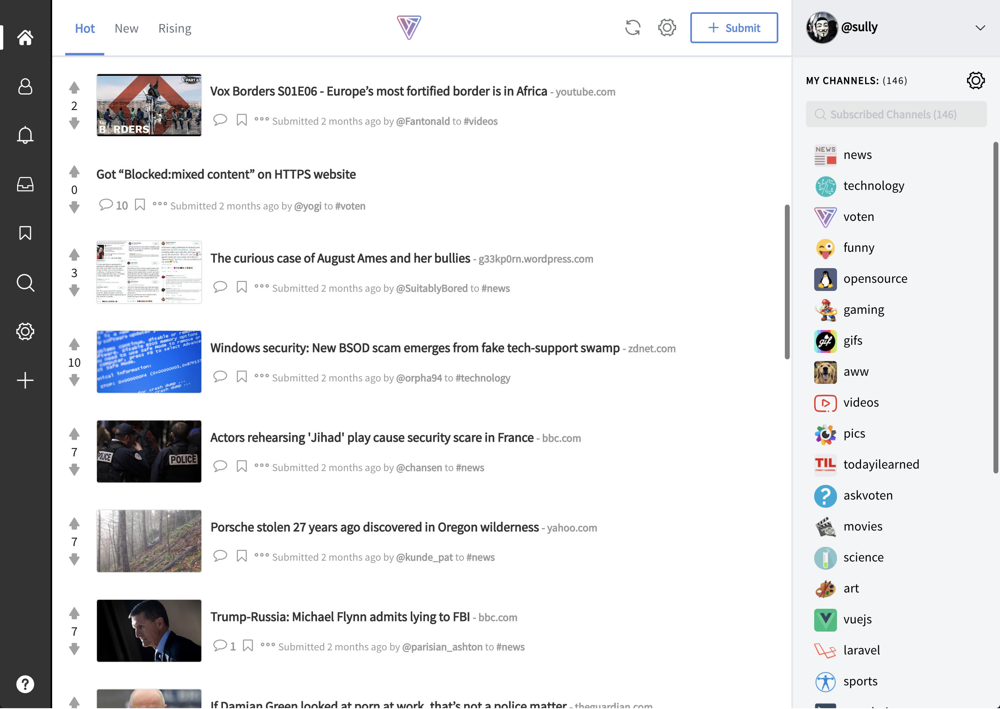
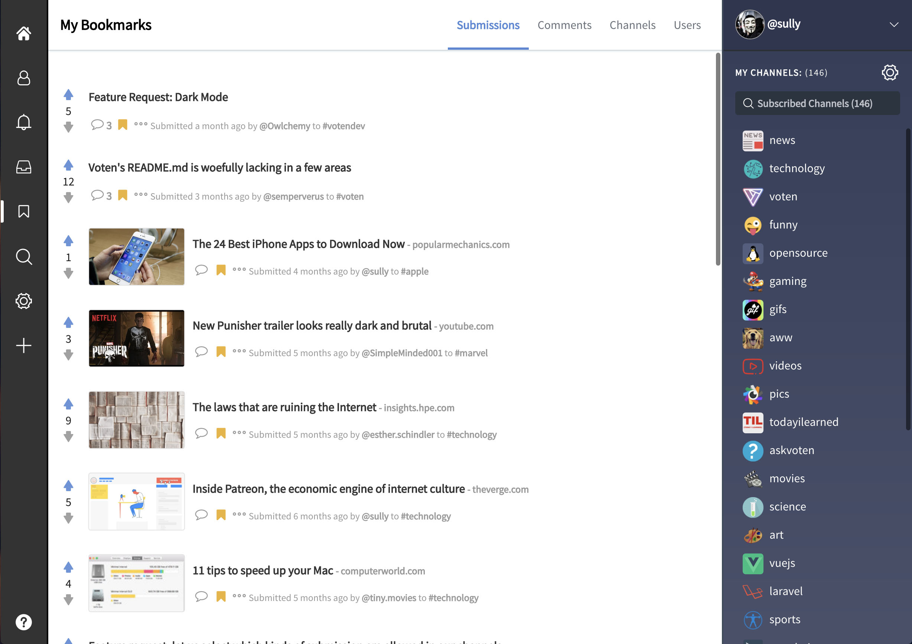
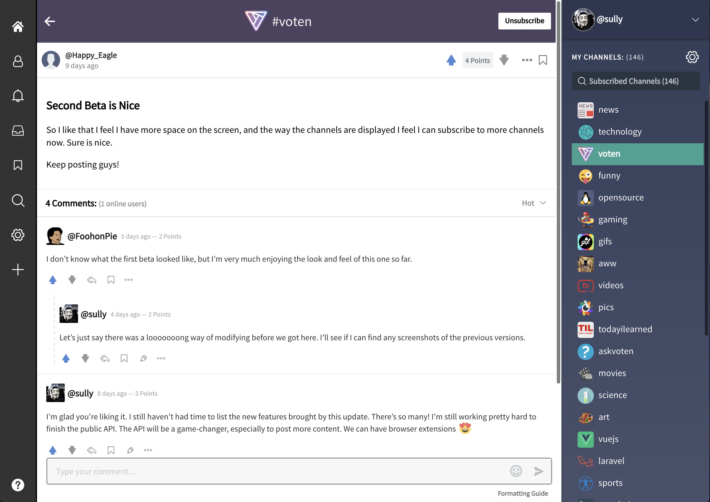

<p align="center">
  <p align="center">
    
  <p align="center">
    Where your vote matters
  </p>
</p>

# [Voten.co](https://voten.co)

[Voten.co](https://voten.co) is an open-source, beautiful, highly customizable yet deadly simple, and warm community. To get a quick taste of what Voten is written with please check our [credits page](https://voten.co/credits).


<p align="center">
  
  
  
</p>

## Contributing

Thank you for considering contributing to the Voten. Here's a list of things you can do to support Voten:

- **Discuss** Voten's development at  [#votendev](https://voten.co/c/votendev) channel. (Voten's editor supports markdown syntax just like Github's)
- **Send PRs**. Voten uses Gitbook for [help center](https://help.voten.co) and [API documentation](https://api.voten.co), and Github to host our source code. All of which support PRs. 
- **Follow** us on [Twitter](https://twitter.com/voten_co) 
- If you're a blogger, write about Voten. If you're a user on Reddit, Twitter, etc, spread the word. 

## Software Stack

Voten is a Laravel application that runs on the following software:

- Ubuntu 16.04.2 LTS
- Nginx 1.10+
- MySQL 5.7+ (to use mariaDB, you must modify `json` type migration columns to `blob` by running `sed -i 's/json(/binary(/g' *` inside the database/migrations/ directory in Linux)
- PHP 7.1+
- Redis 3.0+
- Git 2.8.4+
- [Pusher](https://pusher.com/) (Voten.co uses [laravel-echo-server](https://github.com/tlaverdure/laravel-echo-server) on production server)
- [Algolia Search](https://www.algolia.com/referrals/fb684d54/join/)

To install all the required stack on a server, we recommend an auto-installation service such as [CodePier](https://codepier.io/?ref=voten).

## Installation Steps

Voten's installation is just like any other Laravel project. In case you face any errors, googling it with a "Laravel" keyword will find you an asnwer faster than opening an issue. 

After cloning the repository, first create a .env from the example file:

```
cp .env.example .env
```

Open ".env" file with your desired editor and enter your services info.
Now run below commands:

```
composer install
php artisan key:generate
php artisan migrate
php artisan passport:install
npm install
npm run production
```

### Create admin user

To create an admin user, run the below command from the root of the project

```
php artisan db:seed --class=AdminUserSeeder
```

The login details for the admin user is `admin` and `password`.

After running the seeder, be sure to clear your redis cache, you should now be able to navigate to `/backend`

## Security Vulnerabilities

If you discover any security vulnerability within Voten's source code, please send an e-mail to Sully Fischer at fischersully@gmail.com instead of opening an issue. All security vulnerabilities will be promptly addressed.

## API

A public API is the next step of Voten's development. In the meanwhile, if you're interested in developing applications on top of our API please contact us at info@voten.co.
