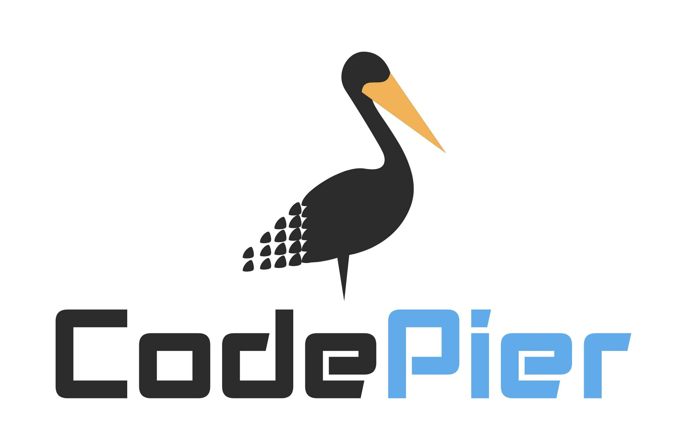

  

    
  

    Where your <strong>vote(n)</strong> matters
  

# [Voten.co](https://voten.co) 

[Voten.co](https://voten.co) is an open-source, beautiful, highly customizable yet deadly simple, and warm community. To get a quick taste of what Voten is written with please check our [credits page](https://voten.co/credits).

<h2 align="center">JesseAI</h2>

[Check out](https://github.com/jesse-ai/jesse) my latest open-source project, an advanced cryptocurrency algo-trading framework called Jesse. 

 

 

## Contributing

Thank you for considering contributing to the Voten. Here's a list of things you can do to support Voten:

- **Discuss** Voten's development at  [#votendev](https://voten.co/c/votendev) channel. (Voten's editor supports markdown syntax just like Github's)
- **Send PRs**. Voten uses Gitbook for [help center](https://help.voten.co) and [API documentation](https://api.voten.co), and Github to host our source code. All of which support PRs. 
- **Follow** us on [Twitter](https://twitter.com/voten_co) 
- If you're a blogger, write about Voten. If you're a user on Reddit, Twitter, etc, spread the word. 
- Help us write unit tests! That's where the code needs help the most. 

## Resources

- [Help Center](https://help.voten.co)
- [Installation guide for source code](/installation.md)
- [Roadmap](https://github.com/voten-co/voten/projects/2)
- [Blog](https://medium.com/voten/)
- [Twitter](https://twitter.com/voten_co)
- [Reddit](https://www.reddit.com/r/voten/)
- [API documentation](https://api.voten.co)
- [#voten](https://voten.co/c/voten) (for general discussion about Voten)
- [#votendev](https://voten.co/c/votendev) (let’s talk code!)

## API

Voten's public API is under development and will be out in April. The Voten API will be organized around REST. It can be used to build non-automated, high-quality apps and services that interact with the platform.

  

## CodePier Partnership 

Voten is proudly partnered with [CodePier](https://codepier.io/?ref=voten) for taking care of our cloud needs. CodePier can install servers, configure them for Voten's used [stack](https://voten.co/credits), and monitor platform's uptime. It even  takes care of advanced needs of ours such as installing a load-balancer. We highly suggest trying them for deploying Voten or any other PHP project of yours. 
